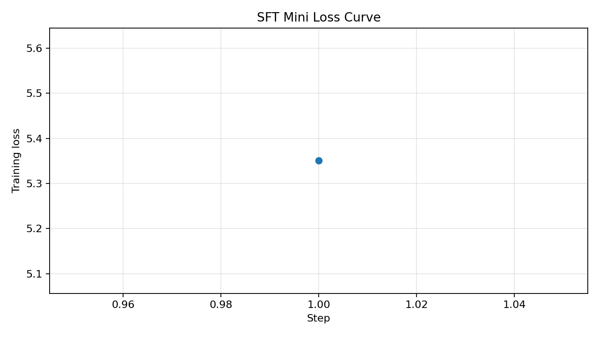

# Day 22 - DPO/ORPO Alignment Lab (Track 3)

## Student Information

- Student name: `Đào Duy Quyền`
- Student ID: `2A202600676`

## Executive Summary

This repository was completed as a real Day 22 Track 3 alignment run:

- SFT mini checkpoint
- preference data generation
- DPO training
- side-by-side SFT vs DPO comparison
- final verification

The final verified run used a local Hugging Face-format model directory with:

- `COMPUTE_TIER=BIGGPU`
- `ALLOW_REMOTE_DOWNLOAD=0`
- `ALLOW_MOCK_ARTIFACTS=0`

No mock artifacts were used in the final verified submission path.

## Final Result

The current workspace contains a completed real run with:

- `reports/smoke_report.json`: local model resolved successfully
- `reports/sft_metrics.json`: `status=trained`, `artifact_mode=real`
- `reports/pref_build_report.json`: `status=built`, `artifact_mode=real`, `row_count=12`
- `reports/dpo_metrics.json`: `status=trained`, `artifact_mode=real`
- `reports/eval_summary.json`: `status=evaluated`, `artifact_mode=real`, `prompt_count=8`
- `reports/verify_report.json`: `status=pass`

Verified eval scoreboard:

- DPO wins: `0`
- SFT wins: `8`
- Ties: `0`

This is not a strong alignment outcome, but it is the honest result of the real local run.

## Runtime Setup

### Intended setup

The intended Track 3 BigGPU configuration was:

```env
COMPUTE_TIER=BIGGPU
BASE_MODEL=/path/to/local/Qwen2.5-7B-Instruct
DEFAULT_MODEL_ID=Qwen/Qwen2.5-7B-Instruct
ALLOW_REMOTE_DOWNLOAD=0
ALLOW_MOCK_ARTIFACTS=0
```

### Actual verified local setup

The machine used for this run had an RTX 3050 Ti Laptop GPU with 4GB VRAM, so Qwen2.5-7B was not feasible in this pipeline. The actual verified run used:

```env
COMPUTE_TIER=BIGGPU
BASE_MODEL=D:\tmp\Qwen2.5-3B-Instruct
DEFAULT_MODEL_ID=Qwen/Qwen2.5-3B-Instruct
ALLOW_REMOTE_DOWNLOAD=0
ALLOW_MOCK_ARTIFACTS=0
SFT_DATASET_SIZE=16
PREF_DATASET_SIZE=12
EVAL_MAX_NEW_TOKENS=160
```

This kept the run fully local and fully real while falling back from 7B to 3B for hardware reasons.

## What Was Implemented

The repo was converted from scaffold/fallback behavior into a real-or-fail Track 3 pipeline:

- local `BASE_MODEL` is required in real BigGPU mode
- invalid local model paths fail clearly
- mock artifacts are only allowed behind explicit `ALLOW_MOCK_ARTIFACTS=1`
- verification checks real adapter files and real report statuses instead of only file existence
- evaluation supports resume and low-memory handling for small VRAM machines

The original Track 1 folder name remains in the filesystem, but the repo contents and execution path are now Track 3.

## Pipeline Order

The real run order was:

```bash
python scripts/smoke.py
python scripts/train_sft.py
python scripts/build_pref_data.py
python scripts/train_dpo.py
python scripts/eval_compare.py
python scripts/verify_lab.py
```

Equivalent `make` targets are also available:

```bash
make smoke
make sft
make data
make dpo
make eval
make verify
```

## Key Outputs

### SFT mini

- output dir: `adapters/sft-mini/`
- screenshot: `submission/screenshots/01_sft_loss.png`
- report: `reports/sft_metrics.json`
- final reported training loss: `5.350604057312012`

### Preference data

- parquet: `data/pref/train.parquet`
- inspect file: `reports/pref_examples.md`
- report: `reports/pref_build_report.json`
- row count: `12`
- required columns present: `prompt`, `chosen`, `rejected`

### DPO

- output dir: `adapters/dpo/`
- screenshot: `submission/screenshots/03_dpo_reward_curves.png`
- report: `reports/dpo_metrics.json`
- chosen reward: `0.001041412353515625`
- rejected reward: `0.00208282470703125`
- reward gap: `-0.001041412353515625`

### Compare and eval

- table: `reports/eval_table.csv`
- markdown table: `reports/eval_table.md`
- screenshot: `submission/screenshots/04_side_by_side_table.png`
- summary: `reports/eval_summary.json`
- fixed prompt count: `8`

### Verify

- report: `reports/verify_report.json`
- final status: `pass`

## Submission Artifacts

Required artifacts produced in the repo:

- `adapters/sft-mini/`
- `data/pref/train.parquet`
- `adapters/dpo/`
- `submission/screenshots/01_sft_loss.png`
- `submission/screenshots/03_dpo_reward_curves.png`
- `submission/screenshots/04_side_by_side_table.png`
- `submission/REFLECTION.md`

Recommended manual screenshots for submission package:

- `02_preference_examples.png`
- `05_verify_pass.png`
- `06_repo_structure.png`

Optional only if completed:

- `07_gguf_export.png`
- `08_benchmark.png`
- `09_llama_cpp_demo.png`

## Evidence Screenshots

### 01. SFT loss curve

Proof file:

- [01_sft_loss.png](submission/screenshots/01_sft_loss.png)



### 02. Preference examples

Recommended proof sources:

- `reports/pref_examples.md`
- `data/pref/train.parquet`

Manual screenshot expected in submission package:

- `submission/screenshots/02_preference_examples.png`

### 03. DPO reward curves

Proof file:

- [03_dpo_reward_curves.png](submission/screenshots/03_dpo_reward_curves.png)


### 04. Side-by-side comparison

Proof file:

- [04_side_by_side_table.png](submission/screenshots/04_side_by_side_table.png)


### 05. Verify pass

Recommended proof source:

- `reports/verify_report.json`

Manual screenshot expected in submission package:

- `submission/screenshots/05_verify_pass.png`

### 06. Repo structure

Recommended proof sources:

- `adapters/sft-mini/`
- `adapters/dpo/`
- `data/pref/train.parquet`
- `reports/`
- `submission/screenshots/`

Manual screenshot expected in submission package:

- `submission/screenshots/06_repo_structure.png`

## Repo Layout

- `configs/`: runtime config, prompts, seed data
- `scripts/`: executable pipeline scripts
- `notebooks/`: notebook versions of the lab steps
- `submission/`: screenshots and reflection
- `reports/`: JSON, CSV, and markdown outputs
- `data/`: generated preference data
- `adapters/`: LoRA adapters from SFT and DPO
- `gguf/`: optional export/deployment outputs

## Notes for the Instructor

- This is a real local Track 3 run, not a report-only scaffold submission.
- The verified final run used local `Qwen2.5-3B-Instruct` because the available 4GB GPU could not support a real 7B run in this pipeline.
- The weaker DPO outcome should be interpreted in the context of a very small dataset, a minimal optimization budget, and strict low-memory constraints.
- The repo is configured to fail clearly in BigGPU real mode when the local model path is missing or invalid.

## Install

Base environment:

```bash
pip install -r requirements.txt
```

BigGPU extras:

```bash
pip install -r requirements-biggpu.txt
```

If you run on Windows and `bitsandbytes` is unstable, WSL/Linux is usually smoother for full training.
